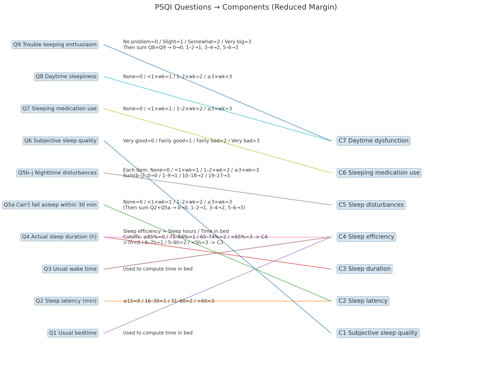

# PSQI_flow_chart
for visual understanding of PSQI



<details><summary>py code</summary>

```py
# Modify the edge labels per your request and re-generate the plot.

import matplotlib.pyplot as plt

# Left nodes (questions) in order
left_nodes = [
    "Q1 Usual bedtime",
    "Q2 Sleep latency (min)",
    "Q3 Usual wake time",
    "Q4 Actual sleep duration (h)",
    "Q5a Can't fall asleep within 30 min",
    "Q5b–j Nighttime disturbances",
    "Q6 Subjective sleep quality",
    "Q7 Sleeping medication use",
    "Q8 Daytime sleepiness",
    "Q9 Trouble keeping enthusiasm"
]

# Right nodes (components)
right_nodes = [
    "C1 Subjective sleep quality",
    "C2 Sleep latency",
    "C3 Sleep duration",
    "C4 Sleep efficiency",
    "C5 Sleep disturbances",
    "C6 Sleeping medication use",
    "C7 Daytime dysfunction"
]

# Map edges and labels (with your requested edits for C3 and C4 around Q4)
edges = [
    # C1
    ("Q6 Subjective sleep quality", "C1 Subjective sleep quality",
     "Very good=0 / Fairly good=1 / Fairly bad=2 / Very bad=3"),
    # C2
    ("Q2 Sleep latency (min)", "C2 Sleep latency",
     "≤15=0 / 16–30=1 / 31–60=2 / >60=3"),
    ("Q5a Can't fall asleep within 30 min", "C2 Sleep latency",
     "None=0 / <1×wk=1 / 1–2×wk=2 / ≥3×wk=3\n(Then sum Q2+Q5a → 0→0, 1–2→1, 3–4→2, 5–6→3)"),
    # C3 (suppress label next to Q4 to avoid overlap)
    ("Q4 Actual sleep duration (h)", "C3 Sleep duration",
     ""),
    # C4 (explicit text near Q1, Q3, and Q4; Q4 carries both C4 and C3 cutoffs inline)
    ("Q1 Usual bedtime", "C4 Sleep efficiency",
     "Used to compute time in bed"),
    ("Q3 Usual wake time", "C4 Sleep efficiency",
     "Used to compute time in bed"),
    ("Q4 Actual sleep duration (h)", "C4 Sleep efficiency",
     "Sleep efficiency = Sleep hours / Time in bed\n"
     "Cutoffs: ≥85%=0 / 75–84%=1 / 65–74%=2 / <65%=3 -> C4\n"
     ">7h=0 / 6–7h=1 / 5–6h=2 / <5h=3 -> C3"),
    # C5
    ("Q5b–j Nighttime disturbances", "C5 Sleep disturbances",
     "Each item: None=0 / <1×wk=1 / 1–2×wk=2 / ≥3×wk=3\nSum(b–j): 0→0 / 1–9→1 / 10–18→2 / 19–27→3"),
    # C6
    ("Q7 Sleeping medication use", "C6 Sleeping medication use",
     "None=0 / <1×wk=1 / 1–2×wk=2 / ≥3×wk=3"),
    # C7
    ("Q8 Daytime sleepiness", "C7 Daytime dysfunction",
     "None=0 / <1×wk=1 / 1–2×wk=2 / ≥3×wk=3"),
    ("Q9 Trouble keeping enthusiasm", "C7 Daytime dysfunction",
     "No problem=0 / Slight=1 / Somewhat=2 / Very big=3\nThen sum Q8+Q9 → 0→0, 1–2→1, 3–4→2, 5–6→3"),
]

# Layout coordinates
left_positions = {name: (0.0, i) for i, name in enumerate(left_nodes)}
right_positions = {name: (1.0, i) for i, name in enumerate(right_nodes)}

# Build the figure
fig, ax = plt.subplots(figsize=(18, 12))

# Draw nodes
for name, (x, y) in left_positions.items():
    ax.text(x - 0.02, y, name, ha="right", va="center", fontsize=10,
            bbox=dict(boxstyle="round,pad=0.3", alpha=0.2))
for name, (x, y) in right_positions.items():
    ax.text(x + 0.02, y, name, ha="left", va="center", fontsize=11,
            bbox=dict(boxstyle="round,pad=0.3", alpha=0.2))

# Draw edges with labels tight to left nodes
for q, comp, label in edges:
    x1, y1 = left_positions[q]
    x2, y2 = right_positions[comp]
    ax.plot([x1, x2], [y1, y2], "-", alpha=0.6)
    if label:
        ax.text(x1 + 0.05, y1, label, ha="left", va="center", fontsize=9, wrap=True)

# Clean axes
ax.set_xlim(-0.25, 1.55)
ax.set_ylim(-1, max(len(left_nodes), len(right_nodes)))
ax.axis("off")
plt.title("PSQI Questions → Components (Edge Labels Tight at Left Nodes)", fontsize=14)

# Save output
out_path_custom = "/mnt/data/psqi_flow_thresholds_leftlabels_custom_q4.png"
plt.savefig(out_path_custom, bbox_inches="tight", dpi=220)
plt.show()

out_path_custom

```

</details>
